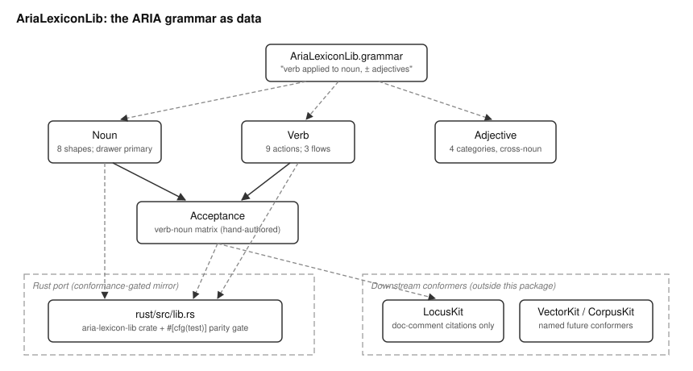

# AriaLexiconLib Overview

## What This Library Does

AriaLexiconLib names the words every MOOTx01 kit uses to describe an action
on memory. Inside MOOTx01, this fixed vocabulary is called ARIA. ARIA states
one simple grammar. Every call to the substrate is one verb applied to a
noun. A caller may constrain that call with adjectives. AriaLexiconLib turns
this sentence into code. A program can then check whether a verb even makes
sense for a noun before it tries the call.

The library has one noun: the Drawer. The Drawer is the atomic unit of
memory. The substrate persists other storage shapes too: a knowledge-graph
fact, a vector, or a diary entry. Each of these is either a facet of a
Drawer or something a verb leaves behind.

The library has nine verbs. Examples include capture, recall, and withdraw.
The library also has four adjective categories. Examples include trust and
sensitivity. An adjective describes a row without changing which noun or
verb it is. A small acceptance matrix records which verbs apply to which
storage shapes.

## The Problem It Solves

MOOTx01 is an on-device AI memory system. It stores what an AI observes over
time. It helps the AI recall that memory later. Many separate packages
build on top of this vocabulary. The SDK described at the top of this
repository set calls these packages kits. One kit stores knowledge-graph
facts. Another stores vector embeddings. Another manages the estate's
day-to-day operations.

If each kit invented its own names for "add a memory" or "remove a
memory," a caller would need to learn a different vocabulary per kit. It
would also become easy to call an operation that makes no sense for a
given storage shape. One example is asking a vector to be captured
directly, instead of letting the substrate manage it.

AriaLexiconLib fixes the vocabulary once, in one place. It states the
vocabulary as data, rather than as prose scattered across each kit's
documentation. Every kit conforms to it. A kit's API surface uses these
same noun and verb names. Its allowed-operations logic reads its answers
from the acceptance matrix. It does not restate the rule on its own. The
vocabulary also crosses languages. The library ships a Rust port so
non-Swift consumers speak the identical words. Shared tests check the two
ports against each other.

The canonical statement of the grammar is a prose document named
ARIA_LEXICON.md. That document lives outside this package. AriaLexiconLib
makes that document first class in code. An editor, a compiler, and a
conformance test can all point at the same set of names.

## How It Works

The library defines four small pieces of vocabulary. It also defines one
rule that relates two of them.

`Noun` lists the eight storage shapes the substrate persists. It marks the
Drawer as the one true noun of the language. The other seven cases each
play one of three roles. A "rung" is a representation of a Drawer's
content, such as a vector. A piece of "structure" is an edge or event about
Drawers, such as an association. A "product" is what a verb leaves behind,
such as a proposal.

`Verb` lists the nine actions the substrate supports: capture, reanchor,
mutate, withdraw, expunge, recall, propose, associate, and learn. Each verb
also names who initiates it. Six verbs are caller-driven. An application
calls each of these directly. Two verbs are substrate-driven. An internal
background process emits each of these on its own schedule. One verb,
`learn`, is grounding-driven. It is how authoritative outside reference
material enters the system.

`Adjective` lists four categories. Each category describes a row no matter
which noun or verb touched it. State describes where the row sits in its
lifecycle, such as active or superseded. Trust describes how the content
was established, such as verbatim or derived. Sensitivity describes how
exposed the content may be. Exportability describes whether the content
may leave the access perimeter. This library only names the four
categories. The specific values inside each category are a detail of how
the data is packed into storage. For example, the full list of lifecycle
states is such a detail. That detail lives in a separate kit, LocusKit.
Keeping it there means the two kits never drift out of agreement by being
defined twice.

`Acceptance` is the one rule that connects `Noun` and `Verb`. For each of
the eight nouns, it lists exactly which of the nine verbs make sense. A
Drawer accepts six verbs, including capture and recall. A Vector accepts
none. The substrate manages vectors on its own, so nothing calls a verb on
one directly. This matrix is hand-authored. No other rule in the library
derives it automatically. It is the single place a caller or a test checks
whether an operation is allowed.

## How the Pieces Fit

Figure 1 shows how the four vocabulary types and the acceptance matrix
relate to each other and to the Rust port.

*Figure 1. Topology of AriaLexiconLib. `Noun` and `Verb` feed the
`Acceptance` matrix. `Adjective` stands beside them as an independent,
cross-noun category list. The dashed regions mark the Rust mirror and the
downstream packages that conform to this vocabulary. This package does not
depend on them.*

`AriaLexiconLib.grammar` states the one-sentence rule in plain English. It
is a constant string. A consumer can display or log the rule itself,
rather than reconstruct it from the types. `Noun` and `Verb` are
independent enumerations. Neither refers to the other.
`Acceptance.verbs(for:)` and `Acceptance.accepts(_:_:)` are the only
functions in the package. Both simply look up a fixed table keyed by a
noun. `Adjective` does not participate in the acceptance rule at all. An
adjective always applies to a row, regardless of its noun or the verb that
produced it.

The Rust port in `rust/` mirrors every type and the acceptance matrix by
hand. The two languages cannot share source code. A build-time conformance
suite inside the Rust crate re-asserts every wire string and every cell of
the acceptance matrix. It checks these against the values recorded here. A
change to either side that the other side misses fails a test. It does not
ship a silent disagreement.

## What Ships in the Package

The package ships five Swift source files. It bundles no data files. It
also ships the Rust port in `rust/`. There are no pinned artifacts and no
build-time tooling. Every value in the package is a literal written
directly in the source. The vocabulary is small and fixed by
specification, rather than computed or trained. The verb count is fixed at
nine. The adjective category count is fixed at four. Both counts are
named spec invariants. Growing either number is a specification change,
not a routine code edit.
