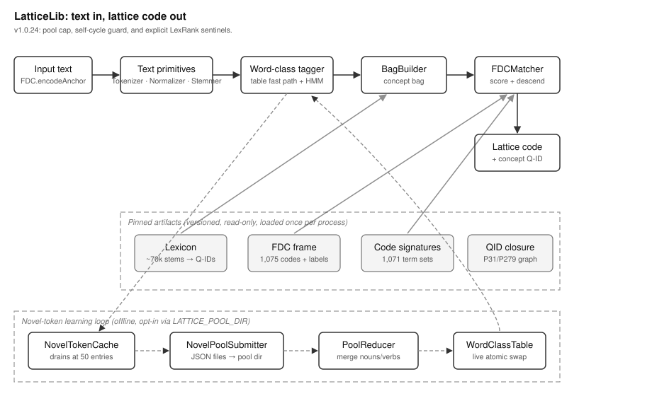

# LatticeLib Overview

## What This Library Does

LatticeLib reads a piece of text and answers one question: what subject is
this about? It answers with a lattice code. A lattice code is a structured
classification code that gives a memory a place in an organized hierarchy of
subjects. For example, the text "the dog chased a ball in the park" encodes
to a code in the animals region of the hierarchy.

MOOTx01 is an on-device AI memory system. It stores what an AI observes over
time and helps the AI recall it later. Every memory that enters the system
passes through LatticeLib. The code that LatticeLib assigns becomes part of
the memory's filing address, so memories about the same subject cluster
together even when they share no exact words.

The engine inside LatticeLib is called FDC, which stands for Frame-Directed
Classification. A frame is a fixed, versioned list of classification codes
and their subject labels. FDC directs every piece of text to its best
position in that frame.

## The Problem It Solves

Two devices must file the same text under the same code. MOOTx01 estates can
federate, which means separate devices share and compare memories. If one
device filed "dog" under animals and another filed it under sports, shared
recall would fall apart. Classification therefore has to be deterministic: the
same input must produce the same output on every platform, every time.

Cloud classifiers cannot promise this. They change without notice, they
require a network, and they see private text. LatticeLib instead ships every
piece of reference data it needs as pinned artifacts. A pinned artifact is a
data file that is built once, given a version, checked into the repository,
and never modified at runtime. The library runs entirely on the device. The
same text against the same artifact versions yields the same code — the
library's agreement property.

The library keeps that promise across two independent implementations. A
Swift leg serves Apple platforms, and a Rust leg (in `rust/`) serves
everything else. Shared conformance fixtures — recorded input and output
pairs that both legs must reproduce exactly — gate every release.

## How It Works

Classification runs in five steps. The first three turn text into a concept
bag. A concept bag is a table that maps each concept found in the text to the
number of times it appears. The last two match that bag against the frame.

Step 1 tags each word and keeps only nouns and verbs. Articles, adjectives,
and everything else carry little subject meaning, so they are dropped. A word
the tagger has never seen is called a novel token. Novel tokens are tagged by
a small, deterministic Hidden Markov Model, so this step never guesses
differently on different platforms.

Step 2 canonicalizes each kept word. The word is normalized (odd Unicode
forms are folded to plain letters), stemmed (reduced to its root, so "dogs"
becomes "dog"), and looked up in the canonicalization lexicon. The lexicon is
a pinned artifact that maps roughly seventy thousand word roots to concept
identities. A concept identity is usually a Wikidata Q-ID — a public,
language-neutral identifier such as `Q144` for "dog." Synonyms collapse onto
one identity, which is what lets two devices agree.

Step 3 accumulates the counts. The result is the concept bag.

Step 4 scores the bag against code signatures. A code signature is the set of
concepts that characterizes one classification code, prepared ahead of time
from reference articles. Codes whose signatures share concepts with the bag
earn scores; rarer shared concepts earn more. The best-scoring code wins. If
nothing overlaps, or too many codes tie, the library returns UNRESOLVED
rather than guess.

Step 5 descends the frame. Starting from the winning code, the matcher walks
down to child codes while the text still supports the extra specificity, and
returns the deepest supported code.

## How the Pieces Fit

Figure 1 shows the library's topology — its major parts and how data moves
between them.

*Figure 1. Topology of LatticeLib. Text flows left to right through the
shared text primitives into the concept bag, then through the matcher to a
code. Dashed regions mark the pinned artifacts and the offline novel-token
learning loop.*

The runtime entry point is the `FDC` enum. Consumers call
`FDC.encodeAnchor(text)` and receive two values: the lattice code and the
dominant concept Q-ID of the text. Loading of the three runtime artifacts
(lexicon, frame, signatures) happens once per process.

The shared text primitives — `Tokenizer`, `Normalizer`, `Stemmer`, and the
word-class tagger — serve both the runtime encoder and the build-time tools.
Build-time tools (`LexiconBuilder`, `SignatureAssembler`, `LexRank`) produce
the pinned artifacts; they never run on user devices.

One slow feedback loop improves the tagger over time. Novel tokens accumulate
in a local cache. When fifty gather, they are written to a local pool
directory. A reducer later merges qualifying tokens into a writable copy of
the word-class table, and the running process adopts the new table with an
atomic swap. Classification stays deterministic because determinism is always
relative to a table version, and the version advances only at that swap.

Privacy is engineered into the seams. When the text being classified is
private memory content, callers pass `recordNovel: false`, and no token of it
is ever written to the pool. The pool itself is off by default; it activates
only when a host sets the `LATTICE_POOL_DIR` environment variable.

## What Ships in the Package

The package ships the Swift sources, the Rust port in `rust/`, and the pinned
artifacts in `Sources/LatticeLib/Resources/`: the frame (1,075 codes), the
code signatures (1,071 entries), the lexicon (about 70,000 entries), the
Q-ID ancestor graph (about 39,000 nodes), the trained tagger model, the
word-class table, and the stemmer conformance corpus. Each artifact carries
its own version string, and the library reports the versions it used, so
every classification is reproducible provenance included.
